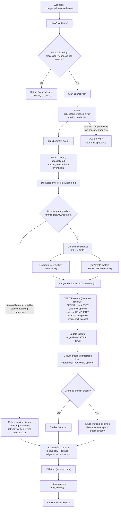
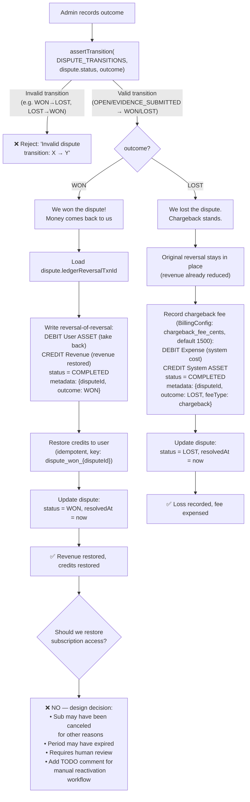

# Solution Diagrams — Refunds & Chargeback Lifecycle

> Visual companion to [SOLUTION.md](./SOLUTION.md). Covers detailed flows, edge case handling, ledger accounting, idempotency mapping, and failure recovery for all implemented billing features.

---

## 1. General Solution Overview

```
┌─────────────────────────────────────────────────────────────────────────┐
│                        EXISTING SCAFFOLD                                │
│                                                                         │
│  ┌──────────────┐   webhook    ┌──────────────────────┐                │
│  │  Gateway Mock │ ──events──▶ │  Webhook Controller   │                │
│  │  (AN/Solana)  │             │  (HMAC + dedup + tx)  │                │
│  └──────┬───────┘             └──────────┬───────────┘                │
│         │                                │                              │
│         │ refundCharge()                 │ applyEvent(tx, event)        │
│         │                                │                              │
│  ┌──────▼───────┐             ┌──────────▼───────────┐                │
│  │  Simulator    │             │  SubscriptionsService │                │
│  │  (test driver)│             │  CreditsService       │                │
│  └──────────────┘             │  LedgerService        │                │
│                                └──────────────────────┘                │
└─────────────────────────────────────────────────────────────────────────┘

┌─────────────────────────────────────────────────────────────────────────────┐
│                        IMPLEMENTED                                   │
│                                                                         │
│  TASK 1: processPaymentRefund          TASK 2: chargeback.received      │
│  ┌─────────────────────────┐          ┌─────────────────────────┐      │
│  │  Admin clicks "Process"  │          │  Webhook event arrives   │      │
│  │         ▼                │          │         ▼                │      │
│  │  Select gateway adapter  │          │  Create Dispute (idemp.) │      │
│  │         ▼                │          │         ▼                │      │
│  │  Call refundCharge()     │          │  Ledger reversal         │      │
│  │  (idempotent, external)  │          │  (inside webhook tx)     │      │
│  │         ▼                │          │         ▼                │      │
│  │  DB Transaction:         │          │  Deduct credits          │      │
│  │   - Ledger reversal      │          │  (idempotent)            │      │
│  │   - Save gatewayRefundId │          │         ▼                │      │
│  │   - Deduct credits       │          │  Store reversalTxnId     │      │
│  │         ▼                │          │  on Dispute              │      │
│  │  Mark PROCESSED          │          └─────────┬───────────────┘      │
│  └─────────────────────────┘                     │                      │
│                                                   ▼                      │
│                                    ┌──────────────────────────┐         │
│                                    │  setOutcome (later, admin)│         │
│                                    │                            │         │
│                                    │  WON → reverse the reversal│        │
│                                    │         + restore credits  │         │
│                                    │                            │         │
│                                    │  LOST → keep reversal      │         │
│                                    │         + $15 fee expense  │         │
│                                    └──────────────────────────┘         │
└─────────────────────────────────────────────────────────────────────────┘
```

---

## 2. `processPaymentRefund` — Full Flow (Task 1)

```mermaid
flowchart TD
    A["Admin clicks 'Process'"] --> A1{"processRefund() loads refund\nstatus == APPROVED?"}
    A1 -->|"No (PENDING/DENIED/PROCESSED)"| A2["❌ Reject: 'Only approved\nrefunds can be processed'"]
    A1 -->|Yes| B{refund.type?}
    B -->|CREDITS| C["processCreditRefund() — already implemented"]
    B -->|PAYMENT| D["processPaymentRefund()"]

    D --> D1{"Guard: refund.paymentRefundId\nalready set?"}
    D1 -->|"Yes — previous attempt wrote\nledger + gatewayRefundId but\nstatus update failed"| W["Skip to: mark PROCESSED\n(ledger + credits already written)"]
    D1 -->|"No — first attempt"| E{refund.gatewayType?}
    E -->|AUTHORIZE_NET| F["adapter = AuthorizeNetGateway"]
    E -->|SOLANA| G["adapter = SolanaGateway"]
    E -->|null / missing| H["❌ Throw: gatewayType required"]

    F --> I["Call adapter.refundCharge()"]
    G --> I

    I -->|"idempotencyKey = refund_{refundId}"| J{"Gateway response?"}

    J -->|"✅ Success: {gatewayRefundId, refundedAmount}"| K["Start DB $transaction"]
    J -->|"❌ Gateway error / network failure"| L["Record error: increment processAttempts,\nsave lastProcessError on refund.\nThrow — refund stays APPROVED.\nAdmin sees error + attempt count in UI."]
    J -->|"⚡ Idempotent hit"| IDEM_NOTE["ℹ️ Gateway returns cached gatewayRefundId\n(no double-refund at processor).\nPrevious $transaction rolled back,\nso ledger + credits still unwritten.\nProceeds to DB transaction fresh."]
    IDEM_NOTE --> K

    K --> M["1. Get/create user ASSET account"]
    K --> N["2. Get/create system REVENUE account"]
    M & N --> O["3. LedgerService.recordTransaction()"]

    O --> P["DEBIT Revenue (decreases revenue)\nCREDIT User ASSET (money returned)\nstatus = COMPLETED"]

    P --> Q["4. Update refund_requests\nset payment_refund_id = gatewayRefundId"]

    Q --> R["5. Deduct credits (idempotent)"]

    R --> S{"User has enough credits?"}
    S -->|Yes| T["Credits deducted normally"]
    S -->|No| U["⚠️ Log warning, continue anyway\nReal money refund > virtual credit balance"]

    T & U --> V["$transaction commits"]
    V --> W
    W["Mark refund status = PROCESSED\n(separate DB call in processRefund)"] --> X["✅ Done — return updated refund"]

    %% Error tracking (wraps all failure paths)
    L --> ERR1["processRefund catch block:\n1. Increment processAttempts\n2. Save lastProcessError\n3. Re-throw original error"]
    ERR1 --> ERR1_UI["Admin UI shows:\n- Error message (red)\n- Attempt count\nRefund stays APPROVED — admin can retry"]

    %% Crash recovery paths
    V -->|"💥 $transaction fails\n(after gateway succeeded)"| Y1["Record error: increment processAttempts,\nsave lastProcessError.\nRefund stays APPROVED.\npaymentRefundId NOT set (rolled back).\nGateway DID refund."]
    Y1 --> Z["Admin sees error in UI,\nretries 'Process'"]
    Z --> CR1_NOTE["ℹ️ Crash Recovery Path 1:\nRe-enters at status check → still APPROVED → passes.\npaymentRefundId is NULL (rolled back) → guard doesn't fire.\nGateway returns cached result (idempotent, no double-refund).\nDB $transaction runs fresh → succeeds this time.\nlastProcessError cleared on success."]
    CR1_NOTE --> A1

    W -->|"💥 status update fails\n(after $transaction succeeded)"| Y2["Record error: increment processAttempts,\nsave lastProcessError.\nRefund stays APPROVED.\nBUT paymentRefundId IS set.\nLedger + credits already written."]
    Y2 --> Z2["Admin sees error in UI,\nretries 'Process'"]
    Z2 --> CR2_NOTE["ℹ️ Crash Recovery Path 2:\nRe-enters at status check → still APPROVED → passes.\npaymentRefundId IS set → guard fires → skips\ngateway call, ledger, and credits entirely.\nJumps straight to mark PROCESSED.\nlastProcessError cleared on success."]
    CR2_NOTE --> A1
```



#### Edge Cases

| Edge Case | How We Handle It |
|-----------|-----------------|
| **Gateway succeeds, DB fails** | Retry is safe: gateway idempotent on key, returns same gatewayRefundId. DB transaction runs fresh. No double-refund. |
| **Gateway declines the refund** | Record error (processAttempts++, lastProcessError saved). Throw. Never touch DB. Refund stays APPROVED. Admin sees error + attempt count in UI, can investigate and retry. |
| **Gateway network timeout** | Same as decline — record error, throw, don't touch DB. Admin sees error in UI and retries. Gateway idempotency prevents double-refund if the original actually went through. |
| **Partial refund (amount < charge)** | We pass refund.amount to gateway + ledger. Both handle arbitrary amounts naturally. |
| **Subscription already canceled** | Normal path. Revenue was realized when sub was active. We reverse that revenue regardless of current sub state. No sub state changes needed. |
| **User already spent their credits** | Deduction fails with insufficient balance. We catch, log warning, proceed with refund. Real money refund takes priority over credits. |
| **Double-click "Process" button** | Second call finds refund status = PROCESSED. processRefund() rejects: "Only APPROVED can be processed." No double-processing. |
| **Concurrent process calls (race)** | First one transitions to PROCESSED. Second one finds non-APPROVED status, throws. Even if both read APPROVED simultaneously, gateway idempotency + ledger metadata idempotency prevent duplication. |
| **Persistent gateway failures** | Each attempt increments processAttempts and records lastProcessError. Admin UI shows error history. No automatic retry — human review ensures admin investigates root cause before retrying. |

---

## 3. `chargeback.received` — Full Flow (Task 2)



### `setOutcome` Flow (Dispute Resolution)



### Chargeback & Dispute Edge Cases

```
┌──────────────────────────────────────┬─────────────────────────────────────────────────┐
│ Edge Case                            │ How We Handle It                                 │
├──────────────────────────────────────┼─────────────────────────────────────────────────┤
│ Chargeback on already-canceled sub   │ NORMAL CASE (not edge). Revenue was recognized    │
│                                      │ when sub was active. We reverse it regardless.    │
│                                      │ Sub state is irrelevant to accounting. No sub     │
│                                      │ state changes needed.                             │
├──────────────────────────────────────┼─────────────────────────────────────────────────┤
│ Duplicate chargeback webhook         │ Three layers of protection:                       │
│ (same eventId replayed)              │ 1. Fast-path: processed_webhooks check            │
│                                      │ 2. Atomic: P2002 on dedup row insert              │
│                                      │ 3. DisputesService: idempotent by gatewayDisputeId│
├──────────────────────────────────────┼─────────────────────────────────────────────────┤
│ Chargeback arrives 45+ days later    │ Same flow. The time gap doesn't affect the logic. │
│                                      │ Ledger entries reference the original transaction  │
│                                      │ via metadata, not by temporal proximity.           │
├──────────────────────────────────────┼─────────────────────────────────────────────────┤
│ User has zero credits at chargeback  │ Deduction fails. We log warning, continue.        │
│ time (already spent them)            │ Dispute + ledger reversal still created.           │
│                                      │ Credits go negative? No — we catch the error.     │
│                                      │ In production: flag for collections review.        │
├──────────────────────────────────────┼─────────────────────────────────────────────────┤
│ Chargeback + refund on same txn      │ Both can coexist. Dispute tracks the chargeback,  │
│                                      │ RefundRequest tracks the voluntary refund. Ledger  │
│                                      │ has separate reversal entries for each. In         │
│                                      │ production: alert on double-reversal exposure.     │
├──────────────────────────────────────┼─────────────────────────────────────────────────┤
│ WON dispute but original reversal    │ We load the reversal via ledgerReversalTxnId.     │
│ txn is missing/deleted               │ If null, log error and skip re-reversal.           │
│                                      │ Defensive coding — shouldn't happen in practice.   │
├──────────────────────────────────────┼─────────────────────────────────────────────────┤
│ setOutcome called twice (double WON) │ assertTransition() rejects: WON is terminal,       │
│                                      │ no valid transitions out. Error:                    │
│                                      │ "Invalid dispute transition: WON → WON".            │
│                                      │ Credits idempotency keys are a second safety net.   │
├──────────────────────────────────────┼─────────────────────────────────────────────────┤
│ LOST — chargeback fee accounting     │ Fee is system-level cost, NOT charged to user.      │
│                                      │ DEBIT Expense (system), CREDIT System ASSET.        │
│                                      │ User ASSET is untouched by the fee.                 │
└──────────────────────────────────────┴─────────────────────────────────────────────────┘
```

---

## 4. Ledger Entries — Deep Dive

All entries must balance: total DEBITs = total CREDITs.

### 4.1 Original charge (already implemented, for reference)

When a user pays for a subscription:
```
DEBIT  User ASSET    +1000    (user now holds 1000 credits)
CREDIT Revenue       +1000    (we recognized $10 of revenue)
```

### 4.2 Payment refund (implemented)

Reverses the original charge:
```
DEBIT  Revenue       +1000    (revenue decreases — debit on credit-normal account)
CREDIT User ASSET    +1000    (asset decreases — credit on debit-normal account)
```

**Why CREDIT ASSET = money leaves**: ASSET is debit-normal, so CREDIT **decreases** it. The user's held credits go down because real money is leaving our system back to them. This matches the architecture doc: `CREDIT User ASSET = the money is gone from our side`.

### 4.3 Chargeback ledger reversal (implemented)

Same pattern as refund — revenue is reversed, asset decreases:
```
DEBIT  Revenue       +1000    (revenue reversed)
CREDIT User ASSET    +1000    (money left our system via chargeback)
```

### 4.4 Dispute WON — reverse the reversal

Money comes back to us:
```
DEBIT  User ASSET    +1000    (asset restored — debit increases debit-normal)
CREDIT Revenue       +1000    (revenue re-recognized)
```

### 4.5 Dispute LOST — record chargeback fee

The reversal stays. Additionally, record the chargeback fee (read at runtime from `billing_config.chargeback_fee_cents`, default 1500):
```
DEBIT  Expense (system)      +<fee>   (cost incurred — debit increases debit-normal)
CREDIT System ASSET          +<fee>   (cash left the system to pay the processor)
```

**Why System ASSET, not User ASSET**: The fee is charged by the payment processor to *us*, not to the user. The user's ASSET account should be untouched. System ASSET represents our operating cash that leaves to pay the network fee.

**Why configurable**: Different processors and card networks charge different amounts. The value is set in the `billing_config` table (seeded to 1500) and read at runtime by `BillingConfigService.getInt('chargeback_fee_cents', 1500)`.

### Summary: All Ledger Entries We Write

```
┌───────────────┬──────────────────────────┬────────────────────────────────┐
│ Event         │ Entry 1                  │ Entry 2                        │
├───────────────┼──────────────────────────┼────────────────────────────────┤
│ Refund        │ DEBIT  Revenue  (system) │ CREDIT User ASSET              │
│               │ Revenue goes down        │ User's held credits go down    │
├───────────────┼──────────────────────────┼────────────────────────────────┤
│ Chargeback    │ DEBIT  Revenue  (system) │ CREDIT User ASSET              │
│               │ Revenue goes down        │ User's held credits go down    │
├───────────────┼──────────────────────────┼────────────────────────────────┤
│ Dispute WON   │ DEBIT  User ASSET        │ CREDIT Revenue (system)        │
│               │ User's credits restored  │ Revenue re-recognized          │
├───────────────┼──────────────────────────┼────────────────────────────────┤
│ Dispute LOST  │ DEBIT  Expense (system)  │ CREDIT System ASSET            │
│ (fee only)    │ $15 fee as cost          │ Cash left the system           │
└───────────────┴──────────────────────────┴────────────────────────────────┘
```

---

## 5. Data Flow — What Gets Written Where

### On Payment Refund (processPaymentRefund)

```
┌─────────────────┐     ┌──────────────────┐     ┌────────────────────┐
│ Gateway (mock)   │     │ Ledger            │     │ Credits            │
│                  │     │                   │     │                    │
│ refundCharge()   │     │ New transaction:  │     │ deductCredits()    │
│ → gatewayRefundId│     │  DEBIT Revenue    │     │ → balance -= amt   │
│                  │     │  CREDIT User ASSET│     │   (if sufficient)  │
└────────┬─────────┘     └────────┬──────────┘     └────────┬───────────┘
         │                        │                          │
         ▼                        ▼                          ▼
┌──────────────────────────────────────────────────────────────────────┐
│                        refund_requests                                │
│  payment_refund_id = gatewayRefundId                                 │
│  status = PROCESSED                                                   │
└──────────────────────────────────────────────────────────────────────┘
```

### On Chargeback (chargeback.received)

```
┌──────────────────┐  ┌────────────────┐  ┌──────────────────┐  ┌──────────────┐
│ processed_webhooks│  │ disputes        │  │ Ledger           │  │ Credits      │
│                   │  │                 │  │                  │  │              │
│ id = eventId      │  │ new row:        │  │ New transaction: │  │ deductCredits│
│ source = AN       │  │  status = OPEN  │  │  DEBIT Revenue   │  │ → balance -= │
│ eventType = CB    │  │  amount = X     │  │  CREDIT User ASSET│ │   (if ok)   │
│                   │  │  reversalTxnId  │  │                  │  │              │
└───────────────────┘  └────────────────┘  └──────────────────┘  └──────────────┘
         ▲                     ▲                    ▲                    ▲
         │                     │                    │                    │
         └─────────────────────┴────────────────────┴────────────────────┘
                          ALL inside ONE $transaction
                          (atomic with webhook dedup)
```

### On Dispute WON

```
┌────────────────┐     ┌──────────────────┐     ┌────────────────────┐
│ disputes        │     │ Ledger            │     │ Credits            │
│                 │     │                   │     │                    │
│ status → WON   │     │ New transaction:  │     │ addCredits()       │
│ resolvedAt=now  │     │  DEBIT User ASSET │     │ → balance += amt   │
│                 │     │  CREDIT Revenue   │     │ key: dispute_won_  │
└─────────────────┘     └──────────────────┘     └────────────────────┘
```

### On Dispute LOST

```
┌────────────────┐     ┌──────────────────┐
│ disputes        │     │ Ledger            │
│                 │     │                   │
│ status → LOST  │     │ New transaction:  │
│ resolvedAt=now  │     │  DEBIT Expense    │
│                 │     │  CREDIT Sys ASSET │
│                 │     │  (from billing_   │
│                 │     │   config table)   │
└─────────────────┘     └──────────────────┘
         No credits change — user already lost them at chargeback time
```

---

## 6. Idempotency Map

Every mutating operation and its idempotency key:

```
┌─────────────────────────────┬──────────────────────────────────┬──────────────────────┐
│ Operation                   │ Idempotency Key                  │ Where Enforced       │
├─────────────────────────────┼──────────────────────────────────┼──────────────────────┤
│ Gateway refundCharge()      │ refund_{refundRequestId}         │ Gateway mock (Map)   │
├─────────────────────────────┼──────────────────────────────────┼──────────────────────┤
│ Credits deduction (refund)  │ refund_deduct_{refundRequestId}  │ CreditsService (JSONB│
│                             │                                  │  inside $transaction)│
├─────────────────────────────┼──────────────────────────────────┼──────────────────────┤
│ Chargeback webhook dedup    │ eventId (gateway event ID)       │ processed_webhooks   │
│                             │                                  │ (unique PK + P2002)  │
├─────────────────────────────┼──────────────────────────────────┼──────────────────────┤
│ Dispute creation            │ gatewayDisputeId (unique col)    │ DisputesService      │
│                             │                                  │ (findUnique check)   │
├─────────────────────────────┼──────────────────────────────────┼──────────────────────┤
│ Credits deduction (CB)      │ chargeback_{gatewayDisputeId}    │ CreditsService (JSONB│
│                             │                                  │  inside $transaction)│
├─────────────────────────────┤──────────────────────────────────┤──────────────────────┤
│ Ledger — refund             │ refund_{refundId}_ledger         │ ledger_transactions  │
│                             │                                  │ .idempotency_key     │
│                             │                                  │ UNIQUE               │
├─────────────────────────────┤──────────────────────────────────┤──────────────────────┤
│ Ledger — chargeback         │ chargeback_{txnId}_reversal_     │ ledger_transactions  │
│                             │ ledger                           │ .idempotency_key     │
│                             │                                  │ UNIQUE               │
├─────────────────────────────┤──────────────────────────────────┤──────────────────────┤
│ Ledger — dispute WON/LOST  │ dispute_{won/lost}_{id}_ledger   │ ledger_transactions  │
│                             │                                  │ .idempotency_key     │
│                             │                                  │ UNIQUE               │
├─────────────────────────────┤──────────────────────────────────┤──────────────────────┤
│ ChargeRecord upsert         │ (gatewayType, gatewayTxnId)      │ charge_records       │
│                             │ composite unique                 │ composite UNIQUE     │
└─────────────────────────────┴──────────────────────────────────┴──────────────────────┘
```

---

## 7. Failure & Recovery Matrix

What happens when things go wrong at each step:

```
┌──────────────────────┬──────────────────┬───────────────────┬──────────────────────────┐
│ Failure Point        │ State After Fail │ Recovery Action   │ Data Consistency          │
├──────────────────────┼──────────────────┼───────────────────┼──────────────────────────┤
│ REFUND: Gateway call │ Refund=APPROVED  │ Admin retries     │ ✅ Clean — nothing was    │
│ fails (network/      │ No DB changes    │ "Process" button  │ written                   │
│ decline)             │                  │                   │                            │
├──────────────────────┼──────────────────┼───────────────────┼──────────────────────────┤
│ REFUND: Gateway OK,  │ Refund=APPROVED  │ Admin retries     │ ✅ Gateway idempotent,    │
│ DB $transaction      │ Gateway refunded │ "Process" button  │ returns same refundId.    │
│ fails                │ but not recorded │                   │ DB transaction reruns.     │
├──────────────────────┼──────────────────┼───────────────────┼──────────────────────────┤
│ REFUND: DB OK,       │ Refund=APPROVED  │ Admin retries     │ ✅ processRefund() will   │
│ final status update  │ Ledger written   │ finds APPROVED,   │ re-run processPayment-    │
│ fails                │ Credits deducted │ re-processes      │ Refund which is idempotent│
│                      │                  │                   │ at every layer.            │
├──────────────────────┼──────────────────┼───────────────────┼──────────────────────────┤
│ CHARGEBACK: Webhook  │ No dedup row     │ Gateway retries   │ ✅ Nothing written.        │
│ handler throws       │ No dispute       │ the webhook       │ Full rollback via          │
│ inside $transaction  │ No ledger entry  │                   │ $transaction.              │
├──────────────────────┼──────────────────┼───────────────────┼──────────────────────────┤
│ CHARGEBACK: Two      │ One wins, one    │ Loser catches     │ ✅ Exactly-once via        │
│ concurrent replays   │ gets P2002       │ P2002, returns    │ unique constraint on       │
│                      │                  │ {skipped: true}   │ processed_webhooks.id      │
├──────────────────────┼──────────────────┼───────────────────┼──────────────────────────┤
│ OUTCOME: setOutcome  │ Dispute unchanged│ Admin retries     │ ✅ Ledger uses metadata    │
│ DB write fails       │                  │ outcome recording │ idempotency keys.          │
│                      │                  │                   │ Credits ops idempotent.    │
└──────────────────────┴──────────────────┴───────────────────┴──────────────────────────┘
```

